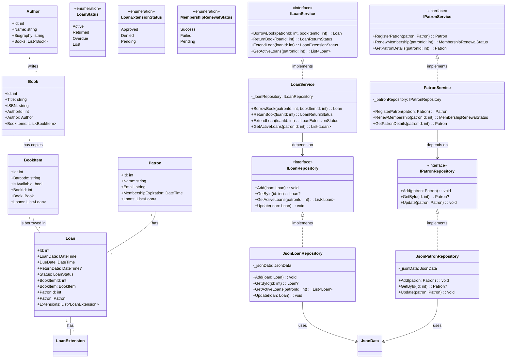

# Library App

## Descrição

Library App é uma aplicação modular desenvolvida para gerenciar operações de biblioteca, como empréstimos de livros, gestão de usuários (patrons) e controle de inventário. Construída em .NET, segue o padrão de arquitetura limpa (Clean Architecture), garantindo escalabilidade, organização e facilidade de manutenção.

## Estrutura do Projeto

- `AccelerateDevGHCopilot.sln` - Arquivo de solução principal do projeto.
- `src/`
  - `Library.ApplicationCore/`
    - `Entities/` - Entidades centrais do domínio (ex: Livro, Usuário, Empréstimo).
    - `Enums/` - Enumerações utilizadas em toda a aplicação.
    - `Interfaces/` - Interfaces para abstração das operações principais.
    - `Services/` - Implementação das regras de negócio e serviços de domínio.
    - `Library.ApplicationCore.csproj` - Projeto do núcleo da aplicação.
  - `Library.Console/`
    - `appSettings.json` - Arquivo de configuração da aplicação console.
    - `CommonActions.cs` - Enumerações de ações reutilizáveis no console.
    - `ConsoleApp.cs` - Lógica principal da interface de console.
    - `ConsoleState.cs` - Gerencia os estados da aplicação console.
    - `Program.cs` - Ponto de entrada da aplicação console.
    - `Json/` - Dados e utilitários em formato JSON (livros, usuários, empréstimos, etc).
    - `Library.Console.csproj` - Projeto da aplicação console.
  - `Library.Infrastructure/`
    - `Data/` - Implementações de acesso a dados (repositórios, leitura/gravação de JSON).
    - `Library.Infrastructure.csproj` - Projeto da camada de infraestrutura.
- `tests/`
  - `UnitTests/`
    - `LoanFactory.cs` - Fábrica para criação de dados de teste de empréstimos.
    - `PatronFactory.cs` - Fábrica para criação de dados de teste de usuários.
    - `ApplicationCore/` - Testes unitários do núcleo da aplicação.
    - `UnitTests.csproj` - Projeto de testes unitários.

## Principais Classes e Interfaces

- **Entidades**
  - `Book` - Representa um livro na biblioteca.
  - `Patron` - Representa um usuário da biblioteca.
  - `Loan` - Representa uma transação de empréstimo.
- **Interfaces**
  - `IBookRepository` - Interface para operações de dados de livros.
  - `IPatronRepository` - Interface para operações de dados de usuários.
  - `ILoanService` - Interface para gerenciamento de empréstimos.
- **Serviços**
  - `LoanService` - Implementa a lógica de negócios relacionada a empréstimos.
  - `NotificationService` - Gerencia notificações de empréstimos em atraso.

# Diagrama UML - Mermaid


## Como Usar

1. Clone o repositório:

   ```bash
   git clone https://github.com/krisnarane/GithubBootcamp
   ```

2. Abra o arquivo de solução `AccelerateDevGHCopilot.sln` no Visual Studio.

3. Compile a solução para restaurar as dependências e gerar os binários.

4. Execute a aplicação console:

   ```bash
   dotnet run --project src/Library.Console/Library.Console.csproj
   ```

5. Execute os testes unitários:

   ```bash
   dotnet test tests/UnitTests/UnitTests.csproj
   ```

## Funcionalidades

- Busca e cadastro de usuários (patrons)
- Consulta e empréstimo de livros
- Controle de devoluções e renovações
- Visualização do histórico de empréstimos
- Notificações para empréstimos em atraso
- Persistência dos dados em arquivos JSON

## Licença

Este projeto está licenciado sob a Licença MIT. Veja o arquivo `LICENSE` para mais detalhes.
